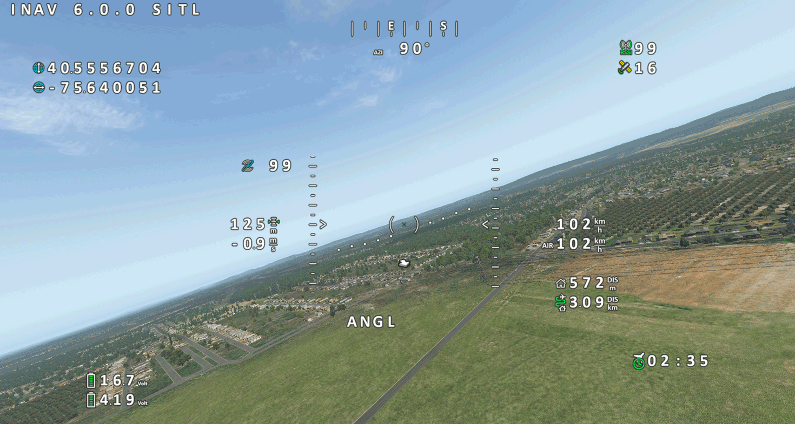
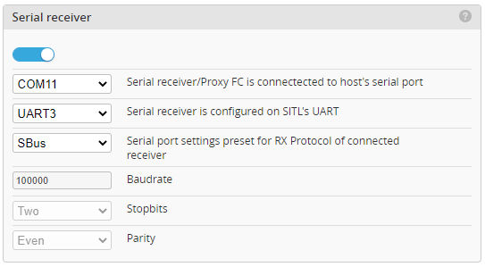
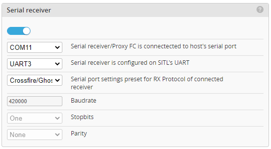

# SITL



## ATTENTION!
SITL is currently still under development.

SITL (Software in the loop) allows to run INAV completely in software on the PC without using a flight controller and simulate complete FPV flights.
For this, INAV is compiled with a normal PC compiler.

The sensors are replaced by data provided by a simulator.
Currently supported are
- RealFlight  https://www.realflight.com/
- X-Plane https://www.x-plane.com/
- fl2sim [replay Blackbox Log via SITL](https://github.com/stronnag/bbl2kml/wiki/fl2sitl), uses the X-Plane protocol.

INAV SITL communicates for sensor data and control directly with the corresponding simulator, see the documentation of the individual simulators and the Configurator or the command line options.

AS SITL is still an inav software, but running on PC, it is possible to use HITL interface for communication.

INAV-X-Plane-HITL plugin https://github.com/RomanLut/INAV-X-Plane-HITL can be used with SITL.

## Sensors
The following sensors are emulated:
- IMU (Gyro, Accelerometer)
- GPS
- Pitot
- Magnetometer (Compass)
- Rangefinder
- Barometer
- Battery (current and voltage), depending on simulator


Select "FAKE" as type for all mentioned, so that they receive the data from the simulator.

## Serial ports
UARTs are replaced by TCP starting with port 5760 ascending. UART1 is mapped to port 5760, UART2 to 5761, etc.

By default, UART1 and UART2 are configured for MSP connections. Other UARTs will have TCP listeners if they have an INAV function assigned.

To connect the Configurator to SITL, select "SITL".

Alternativelly, select "TCP" and connect to ```localhost:5760``` (or ```127.0.0.1:5760``` if your OS doesn't understand `localhost`) (if SITL is running on the same machine).

IPv4 and IPv6 are supported, either raw addresses or host-name lookup.

The assignment and status of used UART/TCP connections is displayed on the console.

```
INAV 6.1.0 SITL
[SYSTEM] Init...
[SIM] No interface specified. Configurator only.
[EEPROM] Loaded 'eeprom.bin' (32768 of 32768 bytes)
[SOCKET] Bind TCP :: port 5760 to UART1
[SOCKET] Bind TCP :: port 5761 to UART2
[SOCKET] ::1 connected to UART1
```

All other interfaces (I2C, SPI, etc.) are not emulated.

## Remote control
Multiple methods for connecting RC Controllers are available:
- MSP_RX (TCP/IP)
- joystick (via simulator)
- serial receiver via USB to serial converter
- any receiver with proxy flight controller


### MSP_RX

MSP_RX is the default, 18 channels are supported over TCP/IP connection.

### Joystick interface
Only 8 channels are supported.

Select "SIM (SITL)" as the receiver and set up a joystick in the simulator.

*Not available with INAV-X-Plane-HITL plugin.*

### Serial Receiver via USB

- Connect a serial receiver to the PC via a USB-to-serial adapter
- Configure the receiver in the SITL as usual
- While starting SITL from configurator, enable "Serial receiver" option

The SITL offers a built-in option for forwarding the host's serial port to the SITL UART.

Please note that 100000(SBUS) and 420000(CRSF) are non-standart baud rates which may not be supported by some USB-to-serial adapters. FDTI and CH340 should work. CP2102/9 does not work.


#### Example SBUS:
For this you need a USB-to-serial adapter, receiver with inverter, or receiver which can output inverted SBUS (normal UART). 

SBUS protocol is inverted UART.

Receiver's SBUS output should be connected to the USB-to-serial adapter's RX pin (via inverter).

With FT-Prog (https://ftdichip.com/utilities/) the signal can be inverted by adapter: Devices->Scan and Parse, then Hardware Specific -> Invert RS232 Signals -> Invert RXD.




### Telemetry
In the SITL configuration, enable serial receiver on some port and configure receiver type "Serial", "SBUS".

#### Example CRSF:

On receiver side, CRSF is normal UART.

Connect receiver's RX/TX pins (and GND, 5V of course) to USB-To-Serial adapter's TX/RX pins (RX to TX, TX to RX).



In the SITL configuration, enable serial receiver on some port and configure receiver type "Serial", "CRSF".

### Proxy Flight controller

The last, but probably the most easiest way to connect receiver to the SITL, is to use any inav/betaflight Flight controler as proxy.

Connect receiver of any type to FC and configure FC to the point where channels are correctly updated in the "Receiver" tab. Inav and Betaflight are supported.

You also can use your plane/quad ( if receiver is powered from USB).


In the SITL configuration, select "Receiver type: SIM" regardles of the kind of receiver used.


## OSD
For the OSD the program INAV-Sim-OSD is available: https://github.com/Scavanger/INAV-SIM-OSD.
For this, activate MSP-Displayport on a UART/TCP port and connect to the corresponding port.

Note: INAV-Sim-OSD only works if the simulator is in window mode.

*With INAV-X-Plane-HITL plugin, OSD is supported natively.*

## Command line

The command line options are only necessary if the SITL executable is started by hand.

There is also a SITL tab in the  INAV Configurator (6.1.0 and later).

The following SITL specific command line options are available:

If SITL is started without command line options, only a serial MSP / CLI connection can be used (e.g. Configurator or other application) can be used.

```--path``` Path and file name to config file. If not present, eeprom.bin in the current directory is used. Example: ```C:\INAV_SITL\flying-wing.bin```, ```/home/user/sitl-eeproms/test-eeprom.bin```.

```--sim=[sim]``` Select the simulator. xp = X-Plane, rf = RealFlight. Example: ```--sim=xp```. If not specified, configurator-only mode is started. Omit for usage with INAV-X-Plane-HITL plugin.

```--simip=[ip]``` Hostname or IP address of the simulator, if you specify a simulator with "--sim" and omit this option IPv4 localhost (`127.0.0.1`) will be used. Example: ```--simip=172.65.21.15```, ```--simip acme-sims.org```, ```--sim ::1```.

```--simport=[port]``` Port number of the simulator, not necessary for all simulators. Example: ```--simport=4900```. For the X-Plane protocol, the default port is `49000`.

```--useimu``` Use IMU sensor data from the simulator instead of using attitude data directly from the simulator. Not recommended, use only for debugging.

```--chanmap=[chanmap]``` The channelmap to map the motor and servo outputs from INAV to the virtual receiver channel or control surfaces around simulator.
Syntax: (M(otor)|S(ervo)<INAV-OUT>-<RECEIVER_OUT>),..., all numbers must have two digits.
Example:
To assign motor1 to virtual receiver channel 1, servo 1 to channel 2, and servo2 to channel 3:
```--chanmap:M01-01,S01-02,S02-03```
Please also read the documentation of the individual simulators.

```--serialport``` Use serial receiver or proxy FC connected to host's serial port, f.e. ```--serialportCOM5``` or ```--serialportdev/ttyACM3```

```--serialuart``` Map serial receiver to SITL UART, f.e. ```--serialuart=3``` for UART3. Omit if using ```--fcproxy```.

```--baudrate``` Serial receiver baudrate (default: 115200)

```--stopbits=[None|One|Two]``` Serial receiver stopbits (default: One)
    
```--parity=[Even|None|Odd]``` Serial receiver parity (default: None)

```--fcproxy``` Use inav/betaflight FC as a proxy for serial receiver.

```--help``` Displays help for the command line options.

For options that take an argument, either form `--flag=value` or `--flag value` may be used.

## Running SITL
It is recommended to start the tools in the following order:
1. Simulator, aircraft should be ready for take-off
2. SITL
3. OSD

For INav-X-Plane-HITL plugin:
1. SITL (Run in configurator-only mode)
2. X-Plane

# #Forwarding serial data for other UART

Other UARTs can then be mapped to host's serial port using external tool, which can be found in directories ```inav-configurator\resources\sitl\linux\Ser2TCP```, ```inav-configurator\resources\sitl\windows\Ser2TCP.exe```
