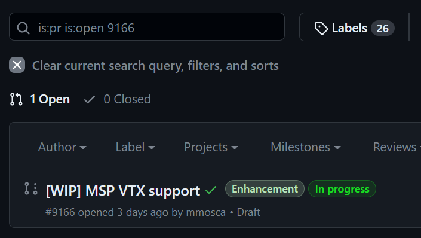

# Introduction
While many of the instructions here are somewhat generic and will likely work for other projects, the goal of these instructions is to assist a non-developer INAV user to acquire firmware that includes a pull request so he can flash it on his supported fc.
Building the pull request manually or using custom/unofficial targets is not the focus of this document.

# Why should you test a pull request?
- You want to volunteer time and resources helping improving INAV for everyone by catching issues before they are introduced in the next release of INAV!
- You reported or are affected by a bug that has been addressed by this pull request and want to help test the fix
- You are interested in testing a new feature implemented by this pull request

# Why should you not test a pull request?
- Pull requests are beta code and may have bugs; bugs may cause you to crash and damage your model
- Upgrading from the stable version of INAV may require changes to your config that are not yet fully documented

# Before you proceed
- Read the comments on the pull request you want to test. It may provide useful context and information on known issues, required configuration changes or what branch of the inav-configurator is required.
- Make sure the pull request has passed all checks, otherwise you may not have pre-compiled firmware images.
- Make a diff all backup of your existing INAV configuration.
- Take notes of what INAV target you are using.
- You will need a recent version of INAV Configurator from master, or even a specific branch. If you don't need a specific branch, [inav-configurator-next](http://seyrsnys.myzen.co.uk/inav-configurator-next/) usually has recent unofficial pre-built versions of INAV Configurator. If your pull requests refers to an inav-configruator pull request, you are likely to need a specific branch of the configurator. In that case you can try to build it from source by following the build [``Instructions``](https://github.com/iNavFlight/inav-configurator#building-and-running-inav-configurator-locally-for-development) or follow instructions on how to do any needed configuration changes using the CLI.

# Finding the pull request
This is easy, but you will need to be logged in to your GitHub account.

Navigate to the INAV github project and click on [``Pull Requests``](https://github.com/iNavFlight/inav/pulls).

You can just scroll through the list to find a pull request you are interested in, or use the filter bar by typing the name of the pull request, or the number, if you know it.

Once you find the one you are looking for, go ahead an open it!

Click on the ``Checks`` tab

Click on ``Build firmware``, it should take you to the ``Actions`` tab.

You should see a summary with a column saying ``Artifacts`` and a number. Click on the number to be taken to the list of artifacts.

On the ``Artifacts`` list, there should be an artifact without SITL in its name.

 Click on it to download the zip file containing pre-compiled firmware images for all INAV official targets. Extract all files and select the firmware for your target using the configurator by clicking on ``Load Firmware [Local]`` button. Don't forget to use the ``Full chip erase`` option, as there are no guarantees the firmware will be compatible with your existing settings.

# I have flashed the new firmware, what should I do next?

- You should configure your model, either manually from scratch, or by loading your diff file. Keep in mind that loading a diff file may not always work, as there may have been some other changes in INAV that require attention. But even if you start from scratch, there are usually many sections that are safe to copy over from your diff.
- Try to reproduce the bug reported or play around with the new feature. 
- Once you are done testing, don't forget to report your results on the pull request. Both positive results and issues are valid and welcome feedback.

